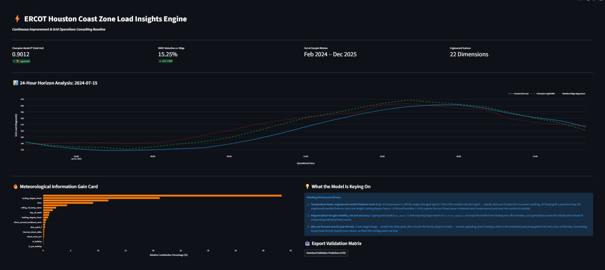
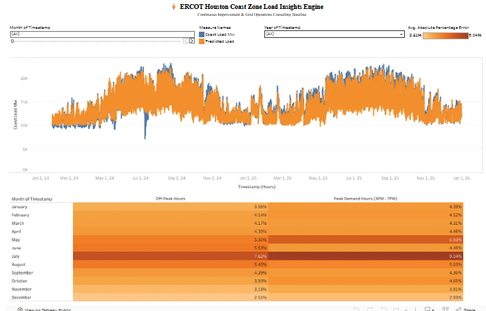

# ⚡ ERCOT Houston Grid Load & Weather Forecasting Pipeline

An end-to-end machine learning and data engineering pipeline that ingests a full decade (2016–2025) of historical grid load and localized hourly weather data to forecast energy demand in the ERCOT Houston (Coast) region.

The project runs in two phases. **Phase 1** establishes a high-accuracy baseline using autoregressive load lags. **Phase 2** deliberately removes those lags and rebuilds the model as a *weather-structural forecaster* — trading a few points of headline R² for a physically interpretable model that can answer scenario questions a persistence model cannot.

[](https://ercot-predictive-modelling-pzanfe9eeappdcuqskncsn9.streamlit.app/)
[](https://public.tableau.com/app/profile/brian.ketchens/viz/ERCOTDashboard_17837275014630/ERCOTGridInsightsEngine)

---

## 📊 Interactive Dashboards

Two live, interactive dashboards let you explore the model and the underlying grid data directly in the browser — no setup required. **Click either image to open the live version.**

### ⚡ Streamlit — Grid Insights Engine
[](https://ercot-predictive-modelling-pzanfe9eeappdcuqskncsn9.streamlit.app/)

An operations control-room view built on the Phase 2 model: pick any day in the Feb 2024 – Dec 2025 hold-out window and compare actual grid load against the champion LightGBM and baseline Ridge forecasts hour by hour, with a live feature-importance card. All KPIs are computed live from the model's own predictions.

### 📈 Tableau — ERCOT Grid Insights
[](https://public.tableau.com/app/profile/brian.ketchens/viz/ERCOTDashboard_17837275014630/ERCOTGridInsightsEngine)

A business-intelligence view of the decade of load and weather data, built for exploratory analysis and stakeholder communication.

---

## 🏗️ System Architecture & Data Pipeline

The project decouples data ingestion, feature engineering, model training, and serving into distinct, modular stages:

```text
ercot-energy-project/
├── data/
│   ├── ercot_historical_data_files/   # Raw manual ERCOT .xlsx downloads (2016-2025)
│   ├── raw/                           # Standardized raw CSV outputs (incl. expanded weather)
│   └── processed/                     # Synchronized master feature matrices
├── src/
│   ├── ingest_weather.py              # Requests the Open-Meteo meteorological archive
│   ├── ingest_ercot.py               # Compiles and normalizes shifting historical ERCOT sheets
│   ├── features.py                   # Phase 2 weather-structural feature pipeline (22 features)
│   ├── train.py                      # Walk-forward time-series training & validation loop
│   ├── reconcile.py                  # Two-model temporal-hierarchy reconciliation experiment
│   └── dashboard.py                  # Streamlit interactive serving layer
└── README.md
```

---

## 🧭 The Two-Phase Arc

| | Phase 1 (baseline) | Phase 2 (this branch) |
| :--- | :--- | :--- |
| Core signal | Autoregressive load lags (24h, 168h) | Weather + calendar drivers only |
| Feature count | ~17 | 22 |
| LightGBM | Light config (200 trees) | Heavily regularized (1500 trees, depth-capped, L1/L2, early stopping) |
| Headline R² (walk-forward) | 0.9283 | 0.9005 |
| What it answers | "What will load be, given recent load?" | "What will load be, given the weather?" |

Phase 2's lower R² is not a regression — it is the measurable price of removing the persistence crutch, and it produces a model that is interpretable and usable for scenario planning. The analysis below quantifies exactly where the difference comes from.

---

## 🛠️ Feature Engineering Domain Mapping (Phase 2)

Phase 2 transforms raw temporal and weather observations into 22 physically-grounded demand indicators. Notably, it contains **no autoregressive load lags** — every feature is an exogenous driver available ahead of time, which is what makes the model usable for genuine scenario forecasting.

- **Realized thermodynamic load (`humidex`):** Combines air temperature and dew point into a single felt-heat index, capturing the compounding effect of humidity on cooling demand.
- **Effective solar penetration (`effective_solar_gain`):** Direct normal irradiance attenuated by cloud cover, modeling actual solar heat gain on buildings.
- **Kinetic wind cooling (`kinetic_cooling_index`):** Temperature discounted by wind speed, since moving air changes the effective cooling load.
- **Thermal adaptation (`thermal_shock_delta`):** Temperature minus its trailing 7-day mean, capturing demand response to *sudden* swings rather than absolute levels.
- **Degree hours (`cooling_degree_hours`, `heating_degree_hours`):** Distance above/below a 65 °F human-comfort baseline, encoding the non-linear surge in HVAC demand at temperature extremes.
- **Peak thermal stress (`peak_thermal_stress`):** Cooling degree hours interacted with the afternoon peak window (15:00–19:00), when heat and demand coincide.
- **Calendar anomalies (`is_holiday`, `is_pre_holiday`):** Federal holidays and their day-before, flagging institutional draw-down.

---

## 🚦 Cross-Validation Strategy

Standard random K-Fold introduces severe chronological leakage in time-series forecasting. To ensure real-world viability, the pipeline enforces a walk-forward split (`TimeSeriesSplit`) across four sequential rolling folds:

| Fold | Training Window | Test Window | Notes |
| :--- | :--- | :--- | :--- |
| 1 | 2016-01 → 2018-07 | 2018-07 → 2020-05 | |
| 2 | 2016-01 → 2020-05 | 2020-05 → 2022-04 | Includes Winter Storm Uri |
| 3 | 2016-01 → 2022-04 | 2022-04 → 2024-02 | |
| 4 | 2016-01 → 2024-02 | 2024-02 → 2025-12 | |

---

## 📈 Experimental Results

All figures below are reproduced from the committed feature matrix using the walk-forward protocol above.

**Phase 2 (weather-structural model):**

| Model | Mean RMSE (MW) | Mean R² | Error Reduction |
| :--- | :--- | :--- | :--- |
| Ridge Regression (baseline) | 1045.73 | 0.8645 | — |
| **LightGBM Regressor (champion)** | **884.01** | **0.9005** | ⬇️ 15.47% |

For reference, the Phase 1 model — which included autoregressive load lags — scored 0.9283 R² / 752.74 RMSE for LightGBM. The next section explains the gap.

---

## 🔬 Phase 2: From Persistence to Physical Drivers

Phase 1's headline R² of 0.9283 looks impressive, but a feature-importance audit reveals *where* that accuracy came from:

| Feature (Phase 1 LightGBM) | Gain share |
| :--- | :--- |
| `load_lag_24h` | **65.4%** |
| `temperature_f` | 18.0% |
| `cooling_degree_hours` | 7.3% |
| everything else | ~9% |

Two-thirds of the model's explanatory power came from a single feature stating, in effect, *"load now ≈ load at this hour yesterday."* That is a persistence model — accurate, but it explains almost nothing about *why* demand moves, and it cannot answer forward-looking questions like *"what happens to load under a 105 °F heat dome?"*

Phase 2 removes both load lags and rebuilds the model on weather and calendar drivers alone. Holding the dataset and validation protocol constant, the effect decomposes cleanly:

| Configuration (walk-forward) | LightGBM R² | Δ |
| :--- | :--- | :--- |
| Phase 1 — with load lags | 0.9283 | — |
| Same data, lags removed (naive) | 0.8897 | −3.86 pts |
| **Phase 2 — expanded weather physics + regularization** | **0.9005** | +1.08 pts recovered |

The interpretation is the core result of the project: removing autoregressive leverage costs ~3.9 R² points, and Phase 2's engineered meteorological features **recover roughly a quarter of that loss** through physical signal alone. The weather engineering demonstrably works — it is not compensating for a broken model, it is reconstructing demand from causes rather than from recent history.

**Why the lower-R² model is the more valuable one:**

- **Scenario capability.** A weather-structural model can forecast load under hypothetical conditions (heat waves, cold snaps, cloud cover). A lag-dominated model can only extrapolate from what load *already did*.
- **Interpretability.** Phase 2 attributes demand to temperature, comfort indices, and solar gain — signals a grid operator can reason about — rather than to "yesterday's load."
- **Honest difficulty.** Exogenous-driver forecasting is the problem utilities actually need solved for planning; persistence is the trivial baseline you are meant to beat, not lean on.

---

## 🔗 Two-Model Temporal Reconciliation (`reconcile.py`)

Phase 2 also prototypes a hierarchical forecasting approach: **Model A** predicts each day's peak load from daily-aggregated weather, **Model B** predicts the hourly shape, and the hourly forecast is rescaled so its daily peak honors Model A's constraint.

The finding is instructive: because Model A's peak prediction is itself uncertain, a miss on the predicted peak propagates into every hour of that day, *amplifying* error rather than reducing it. The direct hourly model therefore remains the shipped configuration — a clean example of choosing the simpler architecture on evidence rather than novelty.

---

## 🔑 Key Analytical Takeaways

- **Where accuracy really comes from:** an R² audit showed 65% of Phase 1's performance rode on a single autoregressive lag — a reminder that a high score can hide a shallow model.
- **The cost of honesty is measurable:** removing lags cost ~3.9 R² points; engineered weather physics recovered ~1.1 of them, isolating the true contribution of meteorological signal.
- **Operational economic framing:** the Phase 2 champion cuts RMSE 15.47% versus its Ridge baseline (~162 MW of average hourly uncertainty). In utility operations, a tighter, weather-driven error bound reduces reliance on expensive, high-emission peaker plants — and, unlike a persistence model, supports forward scenario planning.
- **Architecture chosen on evidence:** the two-model reconciliation experiment was tested and rejected in favor of the more robust direct hourly forecaster.

---

## 🚀 How to Execute the Pipeline

### 1. Environment setup

```bash
python -m venv .venv
source .venv/Scripts/activate   # macOS/Linux: source .venv/bin/activate
pip install -r requirements.txt
```

### 2. Source the raw data

Download the annual ERCOT hourly load archive sheets (2016–2025) from the ERCOT Grid Hourly Load Archives and place the `.xlsx` files into:

```text
data/ercot_historical_data_files/
```

### 3. Run the pipeline end to end

```bash
# Ingest a decade of hourly Houston weather data (Open-Meteo API)
python src/ingest_weather.py

# Parse and compile the local ERCOT sheets into a clean raw matrix
python src/ingest_ercot.py

# Build the Phase 2 weather-structural feature matrix (22 features)
python src/features.py

# Run walk-forward validation for Ridge vs. LightGBM
python src/train.py

# (Optional) Reproduce the two-model reconciliation experiment
python src/reconcile.py
```

### 4. Launch the interactive dashboard

```bash
streamlit run src/dashboard.py
```
